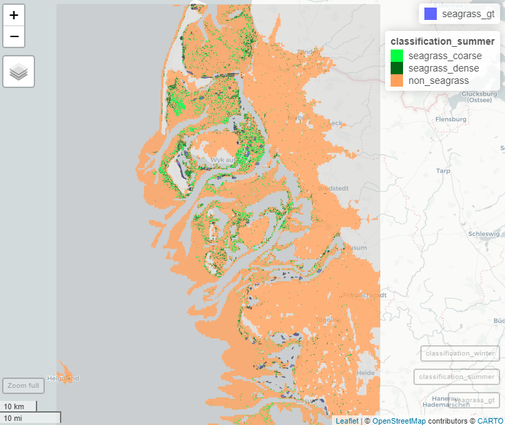
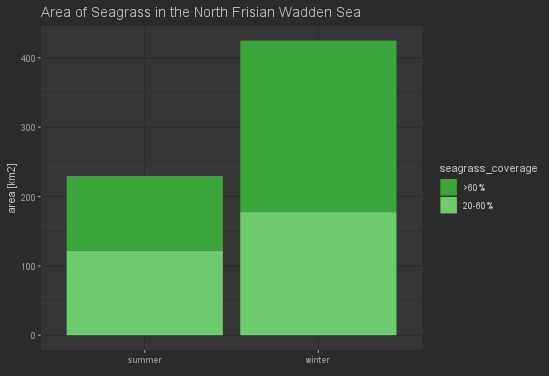
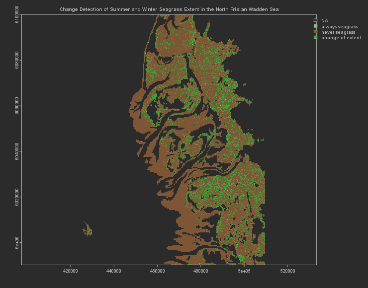

# Seagrass Classificaion in the North Frisian Wadden Sea

## Introduction
The three R scripts `0-datadownload.R`, `1-classifiaction.R` and `2-results.R` perform a complete workflow of seagrass classification in the North Frisian Wadden Sea. Necessary data is provided in the folder `data`.

## Description of the Scripts
`0-datadownload`: Sentinel-1 imagery in two specifies time frames (summer 2022 and winter 2023) are automatically downloaded for the aoi (provided in the 'data' folder) from the Copernicus Open Access Hub. The images are cropped to a specific water depth relevant for seagrass occurrence. The Ocean Bayometric data was downloaded from GEBCO (https://www.gebco.net/data_and_products/gridded_bathymetry_data/#global) and provided in the `data` folder.

`1-classification`: Two models, Random Forest and SVM, are trained based on seagrass occurrence ground truth data from summer 2021 from the Umweltportal Schleswig-Holstein (https://umweltportal.schleswig-holstein.de/trefferanzeige?docuuid=a14cf8b7-dd8c-4661-9f67-10ee73ae1feb) and the Sentinel-2 summer image. We only choose the summer image because the ground truth data was also mapped in summer. The training data is provided in the `data` folder, classes are categorised as follows:

|class_id|status|coverage|      
|----|-----|-------|      
|1|seagrass|20-60%|
|2|seagrass|>60%|
|3|no seagrass|-|

Performance of both models are evaluated, overall accuracy is approx. 80% for both models. However, the random forest model classifies more seagrass correctly. Thus, the two downloaded Sentinel-2 images are classified using the trained random forest model.

This is the summer classification with the groundtruth seagrass distribution as a shapefile overlay:

`2-results`: First, the total area of seagrass classified in the aoi is calculated. Then, a change detection between the two classifications of summer 2022 and winter 2023 is performed. It can be seen that the two classifications differ quite strongly from each other, with more seagrass classified in the winter image. 

## Discussion
It is important to note that the ground truth data from summer 2021 used as training input to the model does not match the ground truth from summer 2022. However, more recent ground truth data is not available yet and an automatic download of Sentinel-2 imagery from the Copernicus Open Access Hub is only possible for data which was acquired during the last year. Consequently, the trained model and performed classification is inacurate.

Nonetheless, these scripts show the basic workflow on how to perform a seagrass classification. They can easily be transferred to other aoi aswell as other applications of land cover classification.

As future work, the provided training data must be improved to match the time stamp of the Sentinel-2 image. Furthermore, the training of the model can be improved by further tuning of parameters such as the number of sampled points per class.
